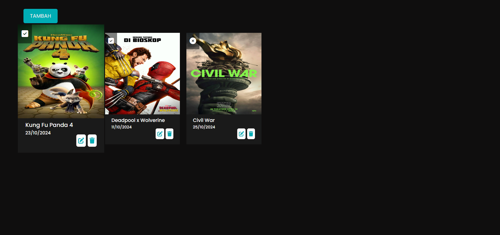
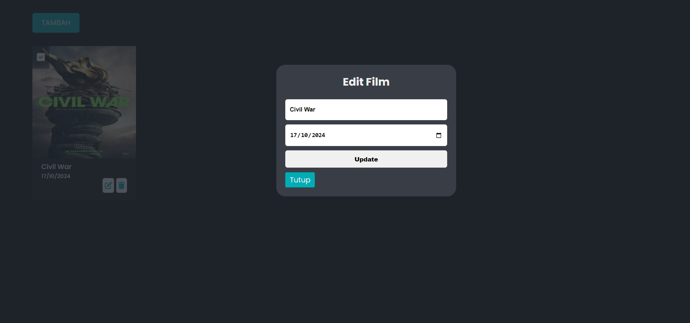
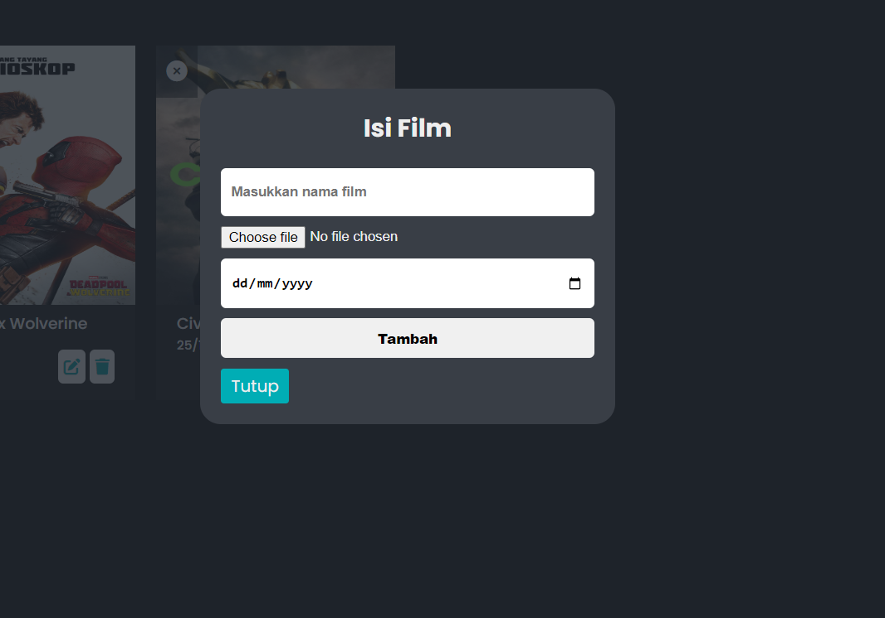

# APLIKASI  DAFTAR LIST FILM

Aplikasi ini merupakan aplikasi sederhana yang dapat digunakan untuk menambahkan, mengedit, dan menghapus daftar film. Aplikasi juga menyediakan fitur untuk menandai film sebagai sudah ditonton atau belum.

## Fitur

1. **Menambahkan Film**: Pengguna dapat menambahkan film baru dengan judul, gambar, dan tanggal rilis.
2. **Edit Film**: Pengguna dapat mengedit data film yang sudah ditambahkan.
3. **Hapus Film**: Pengguna dapat menghapus film dari daftar.
4. **Menandai Film**: Pengguna dapat menandai film sebagai sudah ditonton atau belum.
5. **Daftar Film**: Menampilkan daftar film yang ditambahkan, beserta statusnya (sudah atau belum ditonton).
6. **Upload Gambar Film**: Mendukung upload gambar film dengan format JPG, PNG, JPEG, dan GIF.

## Teknologi Yang Digunakan

- HTML
- CSS
- PHP
- SQLite
- Font Awesome

## Penggunaan

- **Menambahkan Film**: Klik tombol `Tambah`, isi judul film, unggah gambar, dan tentukan tanggal rilis.
- **Mengedit Film**: Pada daftar film, klik ikon pensil pada film yang ingin diubah.
- **Menghapus Film**: Klik ikon tempat sampah pada film yang ingin dihapus.
- **Menandai Film Sudah Ditonton**: Klik kotak centang pada film untuk menandai apakah sudah atau belum ditonton.

---

> **JIKA ADA KESALAHAN, BUG, DAN FITUR BARU BERIKAN KOMENTAR KALIAN DI ``` ISSUES ``` TAB**




